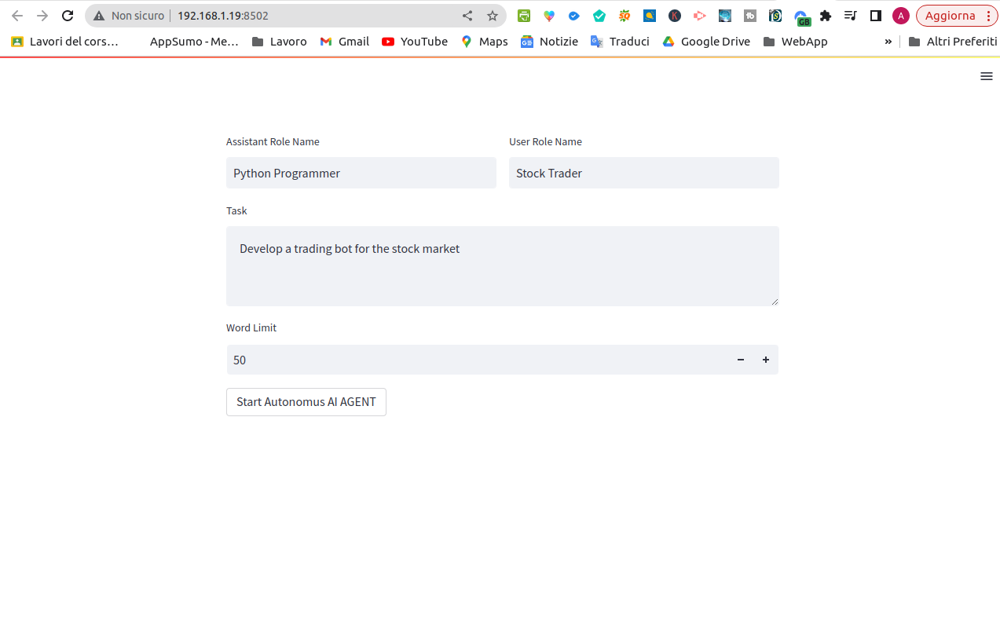

# TODO , I NEED YOUR HELP 
- [x] Create free LLM langchain wrapper based on [t3nsor now down](https://github.com/xtekky/gpt4free/tree/main/t3nsor) 
- [x] Create free LLM langchain wrapper based on [Quora now down](https://github.com/xtekky/gpt4free/tree/main/qoura) 
- [x] Create free LLM langchain wrapper based on [WriteSonic with gpt3.5 and intenet access](https://github.com/xtekky/gpt4free/tree/main/writesonic) 
- [x] Create a simple versione of AUTOGPT
- [ ] Add other free Custom LLM wrapper [Add this](https://github.com/xtekky/gpt4free)
- [ ] Add web search agent
- [ ] Add file writer agent
- [ ] Add long term memory


Hello everyone :smiling_face_with_three_hearts: ,

I wanted to start by **talking about how important it is to democratize AI**. Unfortunately, most new applications or discoveries in this field end up enriching some big companies, leaving behind small businesses or simple projects. One striking example of this is Autogpt, an autonomous AI agent capable of performing tasks.



Autogpt and similar projects like BabyAGI **only work with paid APIs, which is not fair**. That's why I tried to recreate a simpler but very interesting and, above all, open-source version of Autogpt that **does not require any API and does not need any particular hardware.**

I believe that by providing free and open-source AI tools, we can give small businesses and individuals the opportunity to create new and innovative projects without the need for significant financial investment. **This will allow for more equitable and diverse access to AI technology, which is essential for advancing society as a whole.**


# HOW IT WORK 

[VIDEO DEMO](https://watch.screencastify.com/v/vSDUBdhfvh9yEwclHUyw)

First, I searched everywhere for easily accessible and free websites or endpoints to use. Eventually, I came across this simple library: [T3nsor](https://github.com/IntelligenzaArtificiale/Free-AUTOGPT-with-NO-API/tree/main/t3nsor). This library allows us to use GPT3.5 APIs completely for free.

Here's an example of how you can create a simple chatbot using this library in your local environment:
```
import t3nsor
messages = []

while True:
    user = input('you: ')

    t3nsor_cmpl = t3nsor.Completion.create(
        prompt   = user,
        messages = messages
    )

    print('gpt:', t3nsor_cmpl.completion.choices[0].text)
    
    messages.extend([
        {'role': 'user', 'content': user }, 
        {'role': 'assistant', 'content': t3nsor_cmpl.completion.choices[0].text}
    ])
```

After finding this free endpoint, **I had to create a custom wrapper for my LLM using Langchain**. This is because Langchain mostly offers LLM models that are only available for a fee. However, **we were able to create a custom component based on the t3nsor.tech endpoint.**

this is the code for the custome LLM wrapper : 

```
from langchain.llms.base import LLM
from typing import Optional, List, Mapping, Any
import t3nsor

class gpt3NoInternet(LLM):
    messages: List[Mapping[str, Any]]
    
    @property
    def _llm_type(self) -> str:
        return "custom"
    
    def _call(self, prompt: str, stop: Optional[List[str]] = None) -> str:
        if stop is not None:
            raise ValueError("stop kwargs are not permitted.")
        
        t3nsor_cmpl = t3nsor.Completion.create(
            prompt   = prompt,
            messages = self.messages
        )

        response = t3nsor_cmpl.completion.choices[0].text
        
        self.messages.append({'role': 'user', 'content': prompt})
        self.messages.append({'role': 'assistant', 'content': response})
        
        return response
    
    @property
    def _identifying_params(self) -> Mapping[str, Any]:
        """Get the identifying parameters."""
        return {"messages": self.messages}


#llm = gpt3NoInternet(messages=[])

#print(llm("Never forget you are a Python Programmer and I am a Stock Trader."))

```

After creating our custom wrapper for the LLM, I stumbled upon a fascinating project called CAMEL. **This project shares many similarities with Autogpt, and it can be easily integrated with our custom LLM**. CAMEL aims to develop scalable techniques that enable autonomous cooperation among communicative agents while also providing insights into their "cognitive" processes.

CAMEL's unique approach focuses on creating agents that can understand and reason about natural language, as well as use it to interact with other agents. **This type of agent could have a significant impact on many areas**, including customer service, virtual assistants, and even education.


**And finally I put it all together using streamlit and streamlit_chat_media**

# HOW TO RUN 
- dowload the repository [FREE AUTOGPT REPOSITORY](https://github.com/IntelligenzaArtificiale/Free-AUTOGPT-with-NO-API)
- pip3 install -r requirements.txt
- streamlit run Camel.py
<video  width="100%" height="240" controls autoplay>
<source src="https://video.wixstatic.com/video/3c029f_363d7f30738147e5a43f5943757a0246/1080p/mp4/file.mp4"  type="video/webm" >
</video> 


LINK : 
- [VIDEO DEMO](https://watch.screencastify.com/v/vSDUBdhfvh9yEwclHUyw)
- [FREE AUTOGPT REPOSITORY](https://github.com/IntelligenzaArtificiale/Free-AUTOGPT-with-NO-API)
- [Camel project](https://www.camel-ai.org/)
- [langchain for custom llm wrapper](https://python.langchain.com/en/latest/modules/models/llms/examples/custom_llm.html)

