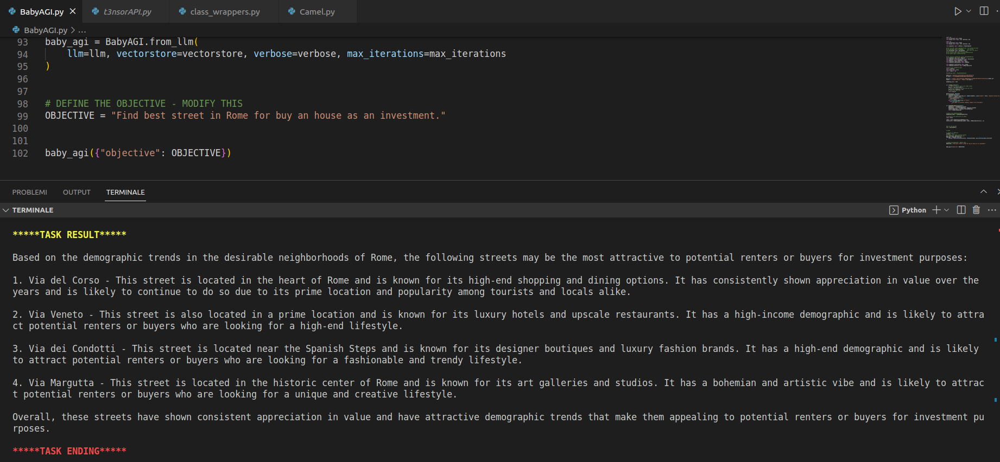

# TODO , I NEED YOUR HELP 
- [x] Create free LLM langchain wrapper based on [t3nsor now down](https://github.com/xtekky/gpt4free/tree/main/t3nsor) 
- [x] Create free LLM langchain wrapper based on [Quora now down](https://github.com/xtekky/gpt4free/tree/main/qoura) 
- [x] Create free LLM langchain wrapper based on [WriteSonic with gpt3.5 and intenet access](https://github.com/xtekky/gpt4free/tree/main/writesonic) 
- [x] Create free LLM langchain wrapper based on [You with gpt3.5 and intenet access](https://github.com/xtekky/gpt4free/tree/main/you) 
- [x] Create free LLM langchain wrapper based on [PHIND with gpt3.5 and intenet access](https://github.com/xtekky/gpt4free/tree/main/you) 
- [x] Add web search agent
- [x] Create a simple versione of AUTOGPT based on [Camel theory](https://arxiv.org/pdf/2303.17760.pdf)
- [x] Find a way to replace OpenAIEmbeddings()
- [x] Create a simple version of AUTOGPT based on [Baby AGI](https://alumni.media.mit.edu/~kris/ftp/SafeBabyAGI-J.BiegerEtAl2015.pdf)

- [ ] Add other free Custom LLM wrapper [Add this](https://github.com/xtekky/gpt4free)
- [ ] Add file writer agent
- [ ] Add long term memory
- [ ] Find a way to replace PINECONE api
- [ ] Find a way to replace official Google API

# HOW TO RUN CAMEL
- dowload the repository [FREE AUTOGPT REPOSITORY](https://github.com/IntelligenzaArtificiale/Free-AUTOGPT-with-NO-API) and extract
- pip3 install -r requirements.txt
- streamlit run Camel.py
<video  width="100%" height="240" controls autoplay>
<source src="https://video.wixstatic.com/video/3c029f_363d7f30738147e5a43f5943757a0246/1080p/mp4/file.mp4"  type="video/webm" >
</video> 


# HOW TO RUN BABY AGI
- dowload the repository [FREE AUTOGPT REPOSITORY](https://github.com/IntelligenzaArtificiale/Free-AUTOGPT-with-NO-API)
- pip3 install -r requirements.txt
- open BabyAGI.py and **change "OBJECTIVE" to whatever you want**
- python3 BabyAGI.py
<video  width="100%" height="240" controls autoplay>
<source src="https://video.wixstatic.com/video/3c029f_363d7f30738147e5a43f5943757a0246/1080p/mp4/file.mp4"  type="video/webm" >
</video> 




-----


# WHY THIS REPOSITORY ?

Hello everyone :smiling_face_with_three_hearts: ,

I wanted to start by **talking about how important it is to democratize AI**. Unfortunately, most new applications or discoveries in this field end up enriching some big companies, leaving behind small businesses or simple projects. One striking example of this is Autogpt, an autonomous AI agent capable of performing tasks.

Autogpt and similar projects like BabyAGI **only work with paid APIs, which is not fair**. That's why I tried to recreate a simpler but very interesting and, above all, open-source version of Autogpt that **does not require any API and does not need any particular hardware.**

I believe that by providing free and open-source AI tools, we can give small businesses and individuals the opportunity to create new and innovative projects without the need for significant financial investment. **This will allow for more equitable and diverse access to AI technology, which is essential for advancing society as a whole.**


-----


# HOW IT WORK ?

[VIDEO DEMO](https://watch.screencastify.com/v/vSDUBdhfvh9yEwclHUyw)

First, find everywhere for easily accessible and free websites or endpoints to use. Eventually, I came across this simple library: [T3nsor](https://github.com/xtekky/gpt4free). This library allows us to use GPT3.5 APIs completely for free. All credit to [xtekky](https://github.com/xtekky/gpt4free)

After finding this free library, **I had to create a custom wrapper for my LLM using Langchain**. This is because Langchain mostly offers LLM models that are only available for a fee. However, **we were able to create a custom component based on the t3nsor.tech endpoint.**

All ...API.py file contain **FREE CUSTOM LLM WRAPPER for LANGCHAIN** . Use is very simple :

```
from t3nsorAPI import gpt3NoInternet  not working the best
from quoraAPI import GPT4QUORA        not working

from sqlchatAPI import sqlchatGPT3   
from phindAPI import phindGPT4Internet
from writesonicAPI import writesonicGPT3Internet
from youAPI import youGPT3Internet

llm1 = youGPT3Internet()
llm2 = writesonicGPT3Internet()
llm3 = sqlchatGPT3()
llm4 = GPT4QUORA()
llm5 = phindGPT4Internet()
llm6 = gpt3NoInternet()

print(llm1("Hello, how are you?"))
print(llm5("what is AI?"))
print(llm6("how have i question in before?"))


```

### With this "CUSTOM LLM WRAPPER" now u can build or test your LLM APP's WITHOUT PAYing

LINK : 
- [VIDEO DEMO](https://watch.screencastify.com/v/vSDUBdhfvh9yEwclHUyw)
- [FREE AUTOGPT REPOSITORY](https://github.com/IntelligenzaArtificiale/Free-AUTOGPT-with-NO-API)
- [Camel project](https://www.camel-ai.org/)
- [langchain for custom llm wrapper](https://python.langchain.com/en/latest/modules/models/llms/examples/custom_llm.html)


# **🤗 Democratize AI 🤗**

